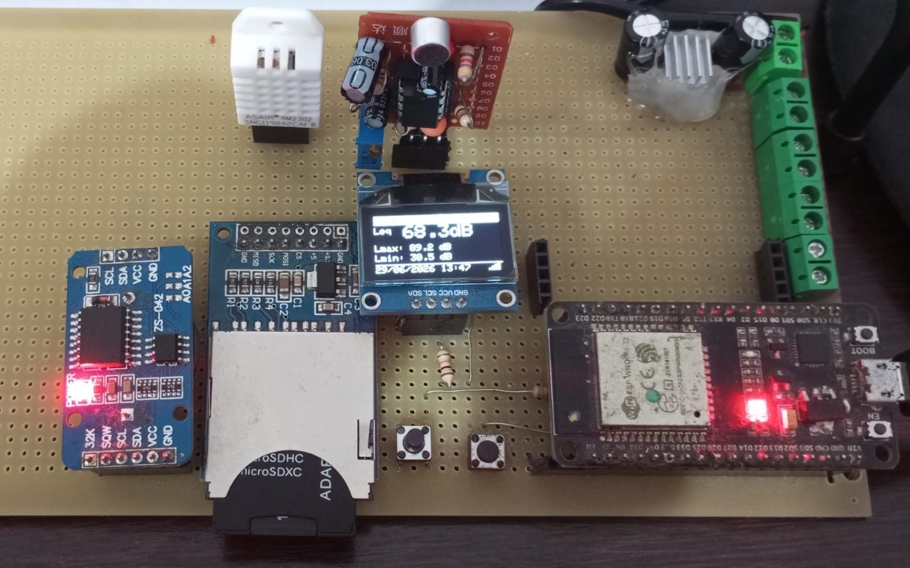
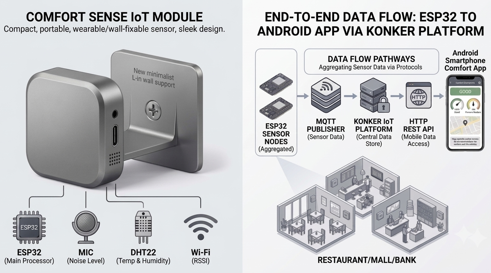
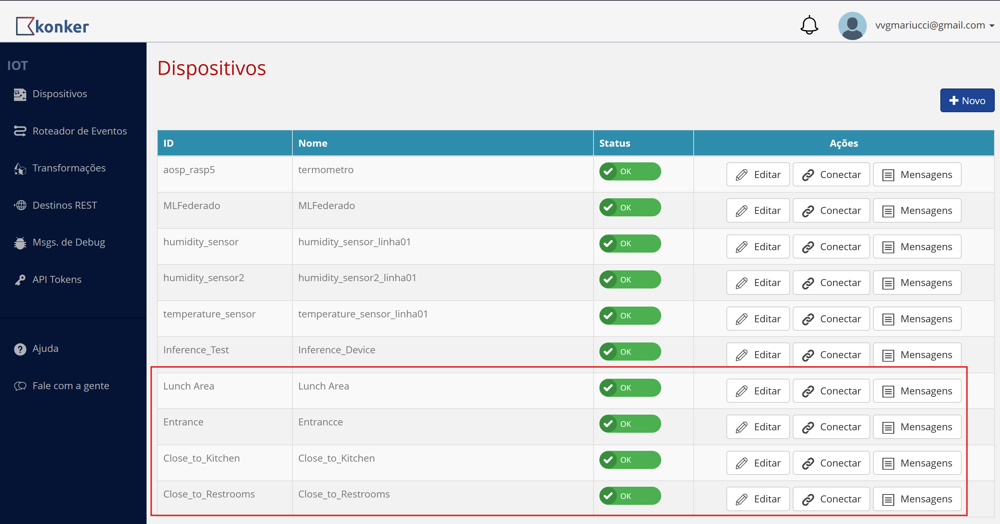
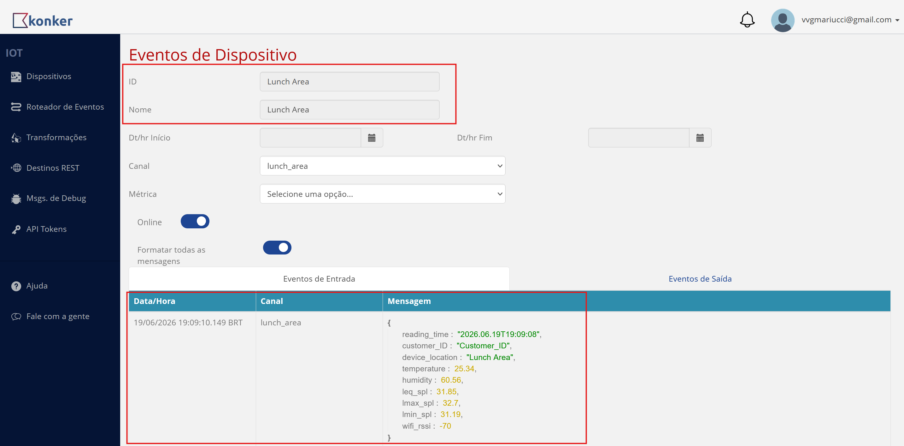
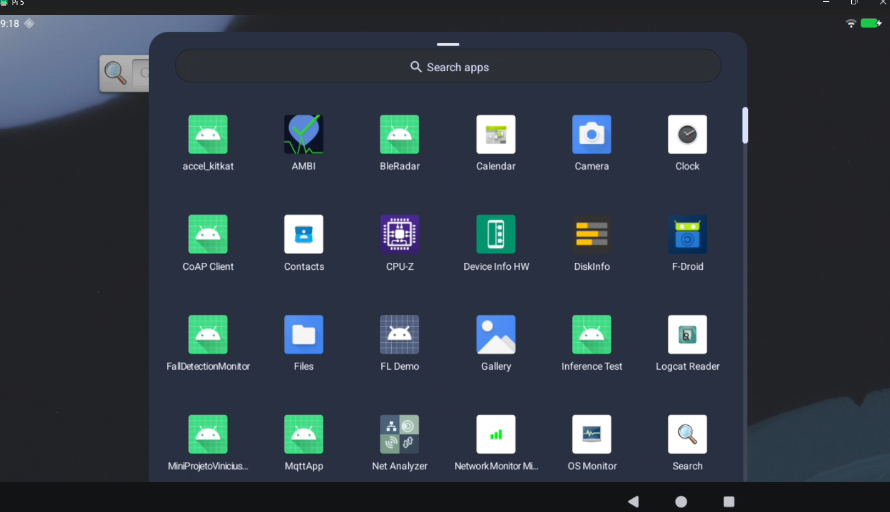
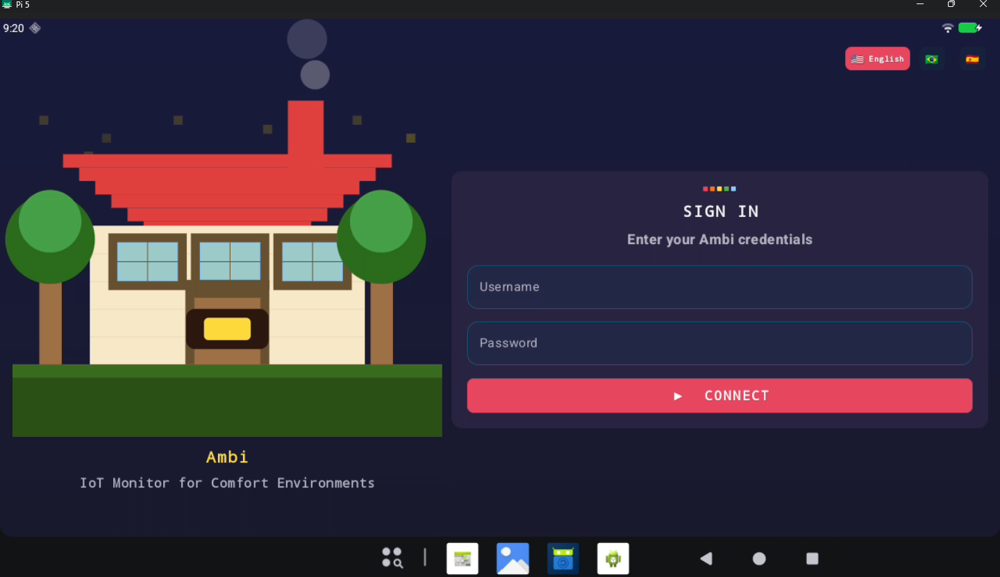
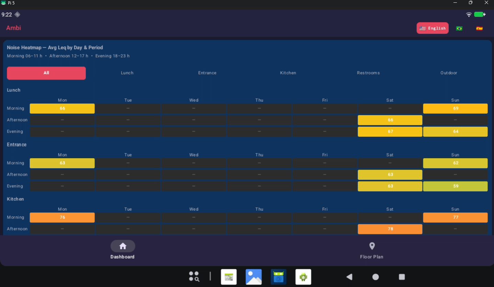
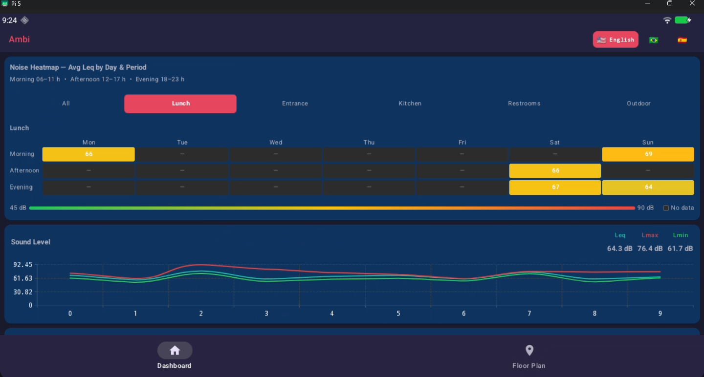
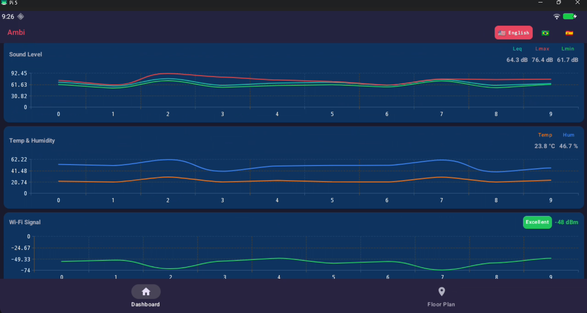
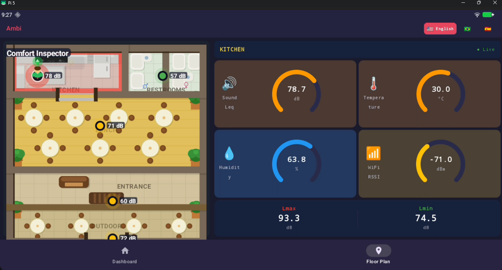

# Ambi — IoT Comfort Monitor

Final project for the "IoT e Android Embarcado" course at Unicamp.

A full-stack IoT system that monitors acoustic and environmental comfort
parameters in a restaurant, combining an ESP32 sensor node with an
Android dashboard.

| Component | Description |
|---|---|
| [`android/`](android/README.md) | Kotlin/Jetpack Compose Android app — Konker IoT dashboard |
| [`esp32/`](esp32/main/README.md) | ESP32 Arduino firmware — SPL measurement + MQTT publishing |

### PoC Hardware Setup

### Product Design Projection and Simple Solution Architecture (MQTT/HTTP/OAuth2)

### Konker IoT Platform Setup

### Ambi Comfort Monitor Android App

